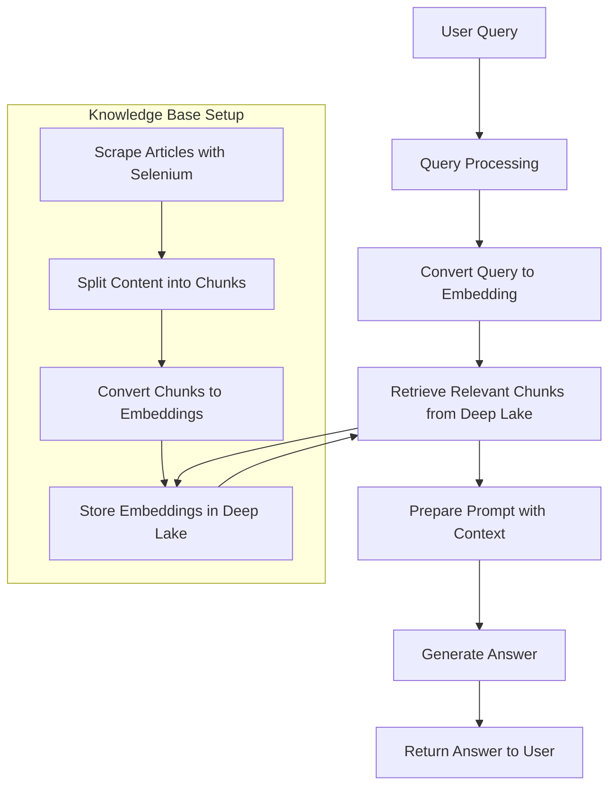

# AI-Powered Customer Support Chatbot [](https://colab.research.google.com/drive/1hkSRF4BLLkP8lFxE0DGhQrLSB1GbZEVD?usp=sharing)

*This chatbot uses Mistral-7B and LangChain to answer customer questions by retrieving relevant information from support articles and generating accurate, helpful responses. Perfect for automating support tasks, it combines semantic search with LLM-powered answers to handle common queries efficiently.*


---

## 🌟 Overview  
An intelligent customer support chatbot that:  
1. **Retrieves** answers from a knowledge base of support articles
2. **Generates** accurate responses using Mistral-7B 
3. **Handles** common customer queries efficiently  

---

## 🚀 Key Features  

### 🔍 Knowledge Base Integration  
- Scrapes support articles from multiple sources
- Splits content into optimized chunks for retrieval
- Stores embeddings in `DeepLake` for fast similarity search

### 🤖 Mistral-7B AI Model  
- **Model**: `mistralai/Mistral-7B-Instruct-v0.1`  
- **Capabilities**:  
  - 7-billion parameter open-weight model  
  - Superior performance in instruction-following tasks  
  - Optimized for summarization and multilingual output

### ⚡ Retrieval-Augmented Generation (RAG)
- Combines document retrieval with LLM generation
- Ensures answers are grounded in support documentation
- Prevents hallucinations by restricting to known information

## 🛠️ Technical Stack
| Component | Technology | Purpose |
|--------------------|--------------------------|----------------------------------|
| Web Scraping | Selenium | Extracting support article content |
| Text Processing | LangChain Text Splitters | Chunking documents optimally |
| Embeddings | Sentence Transformers | Generating semantic embeddings |
| Vector Store | DeepLake | Storing/retrieving document embeddings |
| LLM | Mistral-7B | Generating responses |
| Framework | LangChain | Orchestrating the pipeline |

---

## 🏗️ System Architecture  


---

## ⚙️ Setup Instructions

### 📦 Prerequisites
- Python 3.10+
- ActiveLoop account (for DeepLake)
- Google Colab (for GPU acceleration)

### 🛠️ Installation
```bash
# Install required packages
pip install unstructured selenium llama-cpp-python langchain
pip install langchain_community langchain-text-splitters deeplake
pip install tiktoken transformers sentence-transformers
```

### 🔑 Environment Configuration
1. Add your ActiveLoop token to Colab secrets
2. Mount Google Drive for model storage

## 🧑‍💻 Usage

### ▶️ Running the Notebook
1. Open `Customer_Support_Question_Answering_Chatbot.ipynb` in Colab
2. Run all cells sequentially
3. Test with sample queries


## 📊 Example Outputs

**Query:** "What does SOS mean on my iPhone?"

**Response:**
"SOS on an iPhone means that your device is out of your network carrier's range to make/receive calls, text messages, or access the internet. It indicates that you can only make emergency calls to numbers like 112 (India & Europe), 911 (United States), 999 (UK), etc."

**Query:** "How do I delete my Spotify account?"

**Response:**
"To delete your Spotify account permanently:
1. Log in to your account page
2. Navigate to 'Account' then 'Close Account'
3. Follow the confirmation steps
Note: Some data may be retained for legal/compliance reasons."

## 📜 License
MIT License - Free for academic and commercial use.

## 🤝 Contributing
1. Fork the repository
2. Create your feature branch (`git checkout -b feature/AmazingFeature`)
3. Commit changes (`git commit -m 'Add some feature'`)
4. Push to branch (`git push origin feature/AmazingFeature`)
5. Open a Pull Request

## ✉️ Contact
For questions or enhancements:
📧 mohammednashaat29@gmail.com
